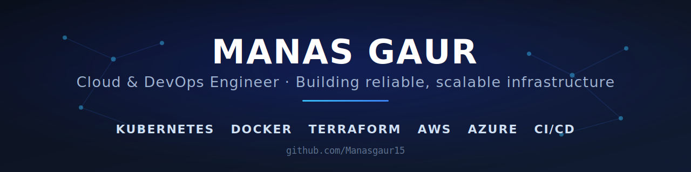

<!-- Banner -->

  

## Hi, I'm Manas 👋

Cloud & DevOps Engineer focused on turning manual, fragile processes into automated, reliable infrastructure. I like the hard, hands-on problems — the ones where you have to understand how every layer fits together, from the Linux box at the bottom to the deployment pipeline at the top.

- 🔭 Working across the full DevOps lifecycle: containers, CI/CD, IaC, cloud, and observability
- 🌱 Currently going deeper on Kubernetes, GitOps, and DevSecOps
- ⚡ I learn fastest by building, and I'd rather own the messy problem than wait for an easy one
- 📫 Reach me: **github.com/Manasgaur15**

---

## 🛠️ Tech Stack

**Cloud**

**Containers & Orchestration**

**CI/CD & GitOps**

**Infrastructure as Code**

**Monitoring & Observability**

**Foundations**

---

## 📊 GitHub Stats

  

---

<i>Building reliable, scalable infrastructure — in public.</i>

